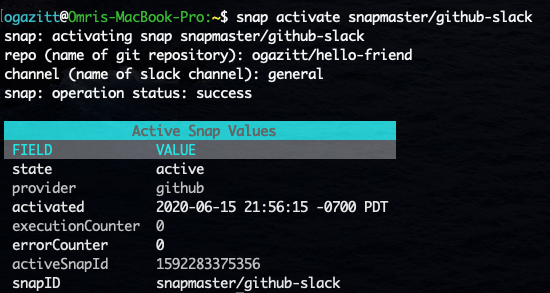

# Activating and managing active snaps

## Activating a snap

`snap activate {snapname}` will activate a snap named `snapname` (as retrieved from the `snap gallery list` command).  This command will prompt for the snap parameter values, if any:

