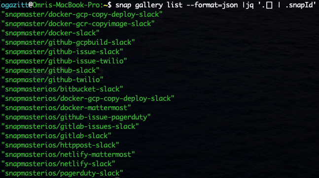

# Formatting output

`snap` can format output either as a table / text (default), or as JSON.

## Formatting as JSON

The global flag `--format=json` will format output as JSON.  This allows `snap` output
to be piped into `jq` for downstream processing:

## Formatting as a table

The global flag `--format=table` (default) will format output as a table.

