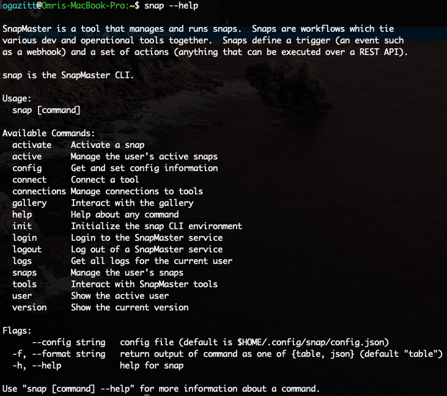
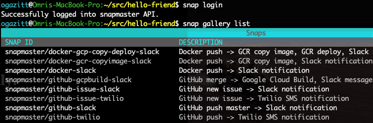

# Getting started with the **snap** CLI

`snap` is the command-line interface (CLI) for SnapMaster.

## Installing **snap**

On a Mac: `brew tap snapmaster-io/snap && brew install snap`

If you have go installed: `go get github.com/snapmaster-io/snap`

## Verifying the installation

`snap version` should display a string like the following:
    
```bash
snap: version <0.5.4>, git hash <9a1677474834f0e2c6c8f89da9a80bc6455e5a9e>
```
    
## Help
    
`snap --help` or `snap command --help` makes it easy to learn about all     of snap's commands.



## Initializing **snap**

`snap init` will create a config file (defaults to $HOME/.config/sna    config.json).  This has the most important configuration for snap:

* API URL: the URL for the API.  Currently defaults to https://dev.snapmaster.io
* Client ID: the OAuth2 Client ID for the app.
* Redirect URL: This is the localhost URL where snap expects the OAuth2 callback.  Defaults to `http://localhost:8085`
* Auth Domain: the OAuth2 server that will handle the PKCE flow. Defaults to `snapmaster-dev.auth0.com`

`snap init` allows any of these to be overridden.

## Logging in

`snap login` will initiate the login flow.  Note that you must have an account provisioned already on the SnapMaster web app for this to work.  

This command will open a browser window, authenticate if necessary, and retrieve an access token.  Upon a successful login, the browser window will look like this:


To verify that you are properly logged in, use `snap gallery list` to 
retrieve the public snaps from the gallery.


