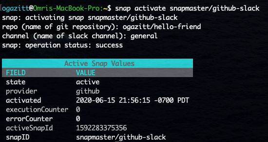
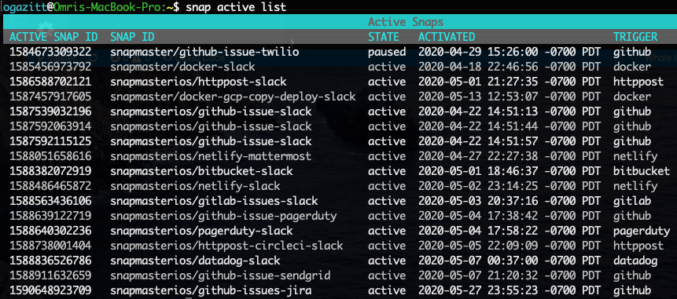

# Activating and managing active snaps

## Activating a snap

`snap activate {snapname}` will activate a snap named `snapname` (as retrieved from the `snap gallery list` command).  This command will prompt for the snap parameter values, if any:

## Managing active snaps

`snap active list` will list all activated snaps:

`snap active get {active snap ID}` will get information about the active snap.

`snap active pause/resume {active snap ID}` will pause or resume an active snap.

`snap active deactivate {active snap ID}` will deactivate and active snap and REMOVE ALL LOGS.

## Interacting with logs

`snap active logs {active snap ID}` will retrieve logs for the active snap ID passed in.

`snap active logs {active snap ID} details {logID}` will retrieve the logs associated with the invocation `logID` of the referenced active snap ID.

`snap logs` will retrieve all logs from ALL active snaps.

`snap logs details {logID}` will retrieve log details for a particular log entry.

