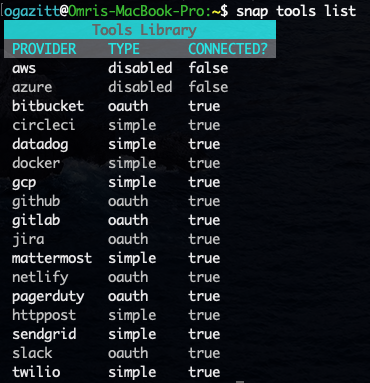

# Managing connections

## Interacting with the Tool library

`snap tools list` will retrieve all the tools in the library:

`snap tools get {tool}` will get the description of a tool.  The tool definition 
language is a YAML syntax documented elsewhere.

## Connecting tools

`snap connect {tool}` will connect a tool, prompting for credentials, and will store a 
default credential-set associated with that tool.

`snap connections list` will list all connected tools.

## Adding and removing credential-sets

`snap connections credential-set add {tool}` will add a new credential-set for the 
specificed tool:

`snap connections credential-set remove {tool} {credential-set-name}` will remove 
the specified credential set from the tool.

