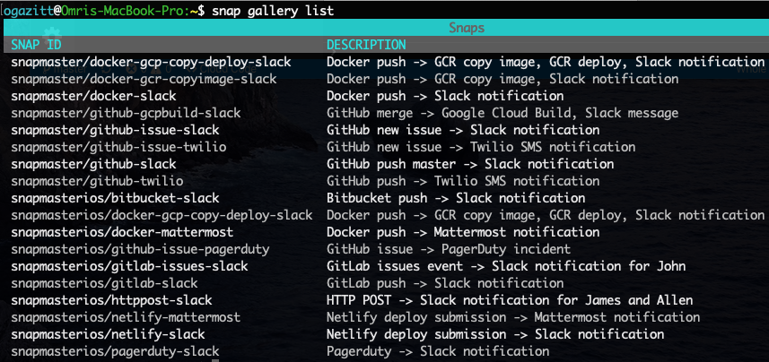
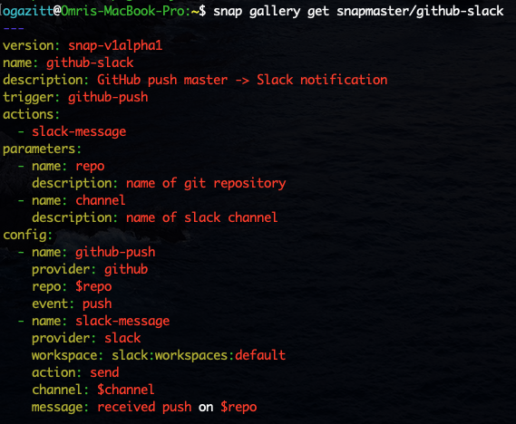

# Managing snaps

## Interacting with the Gallery

`snap gallery list` will retrieve all the snaps in the gallery:

`snap gallery get {snapname}` will get the description of a snap.  The snap definition 
language is a YAML syntax documented elsewhere.

`snap snaps fork {snapname}` will fork a public snap into the user's account.

## Managing your own snaps

`snap snaps list` will list all snaps in the user's account.

`snap snaps get {snapname}` will get the description of a snap in the YAML syntax.

`snap snaps delete {snapname}` will delete a snap from the user's account.

`snap snaps publish/unpublish {snapname}` will make a snap public (discoverable) or switch it back to private.

