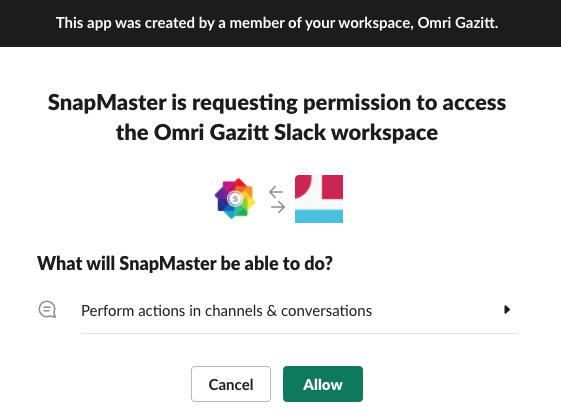

# Activating your first snap

In this tutorial we will activate the `docker-slack` snap, which provides a gentle
introduction to snaps.

Before you activate a snap, the Dashboard is empty:

## Browsing the Gallery

Click the Gallery link (or the Gallery tab in the side navigation bar).  This will bring up 
the SnapMaster Gallery.  The Gallery contains a number of "starter" snaps to get you going.

## Exploring the `docker-slack` snap

Select the `snapmaster/docker-slack` snap.  This will show the details of this snap.

You can check out the YAML definition of the snap by selecting the "Code" tab:

Before you can activate a snap, you have to connect all the tools that it references.

Since you don't have either Docker or Slack connected, we need to connect these with your 
credentials.

## Connecting Docker

Clicking the "connect" button will navigate to the Tools page:

Clicking the "Docker" icon will bring up the Docker tool page.  This describes the 
triggers and actions that this tool supports.

Click the "Connect" button will prompt for Docker credentials:

Once Docker is connected, a credential-set will be displayed:

## Connecting Slack

Click the "Tools" tab on the navigation bar (or in the breadcrumb) to go back to the Tools 
page.  Now click the "Connect" button for the Slack tool:

Slack supports the OAuth2 authorization protocol, which will redirect the user to the Slack
authorization page.  Select "Allow" to authorize SnapMaster to perform Slack actions:

## Activating the snap

Now that both Docker and Slack are connected, navigate back to the Gallery by selecting 
the Snaps tab and the Gallery side navigation tab.  Select the `snapmaster/docker-slack' 
snap, select the Activate tab, and fill in a docker repository name and a slack channel 
name:

If the repo exists and you are its owner, a webhook has been created on the repo, and 
the snap will be activated when a new image is pushed to that repository.  The snap is 
now activated:

## Snap actions

You can pause and resume the snap, which will remove the webhook and reinstall it, 
respectively.

Clicking "Test" will simulate a trigger, and invoke the set of actions associated with 
the snap.  In this case, a slack message will be sent to the channel specified in the 
channel parameter.

## Snap logs

If you clicked "Test" in the step above, the Logs page will be visible.  You may need to 
refresh the data using the refresh button to see the logs for this activated snap:

To see the details associated with a particular invocation, click the row:

## Active snap list

The snap is now active.  Clicking the Active Snaps tab in the side navigation bar will show 
the list of active snaps, which is how you can find and manage this active snap.

## Next steps

You now know the fundamentals.  Next, explore the CLI!

