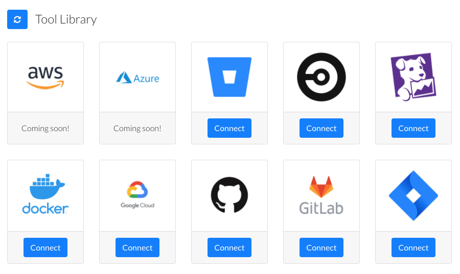

# Tools

Tools are a collection point for triggers, actions, and credentials.

The set of available tools can be views in SnapMaster by clicking the `Tools` tab.



In the CLI, the following command retrieves the set of tools: 
```bash
snap tools list
```

The resulting table will list whether a tool is connected, and its connection type:


